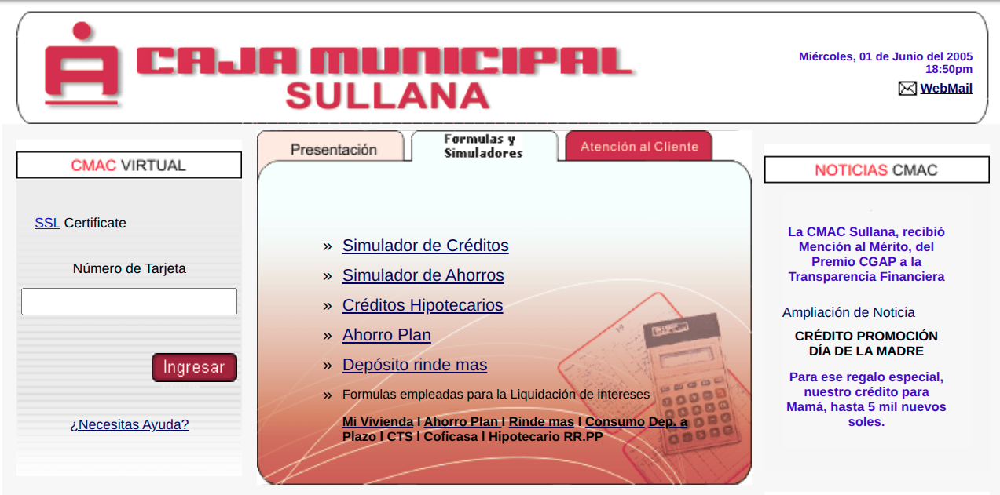

# Proyecto CMAC (*circa 2001*)

<div align=center>

|||
|-|-|
Sitio web institucional de la **Caja Municipal de Ahorro y Crédito de Sullana** (CMAC Sullana), institución financiera peruana fundada en 1986 especializada en microcrédito y captación de ahorro popular en las provincias de Sullana, Talara, Tumbes, Barranca y Huaura-Huacho.|

</div>

## Estructura (en directorio [web](web/))

```
├── index.htm                    # Portada
├── cgi-bin                      # Scripts CGI en Perl
│   ├── basesdatos/              # Tablas de tasas y datos de empleados
│   └── plantillas/              # Plantillas HTML para los scripts CGI
├── archivossubidos/             # Noticias publicadas (noticortas.htm + .bd)
└── basurero/                    # Hojas de estilo descartadas
```

## Análisis

<div align=center>

|[Claude](docs/README_CLAUDE.md)|[Gemini](docs/README_GEMINI.md)|[Z.ai](docs/README_ZAI.md)|
|-|-|-|
Buenas prácticas de siempre, aplicadas cuando no eran lo habitual — y eso no debería sorprender a nadie.|Arquitectura financiera de 2002 que emplea Perl y bases de datos planas para lograr modularidad y eficiencia corporativa en un entorno de recursos limitados.|Documento histórico de programación web circa 2001 con valor académico y arqueológico

</div>
